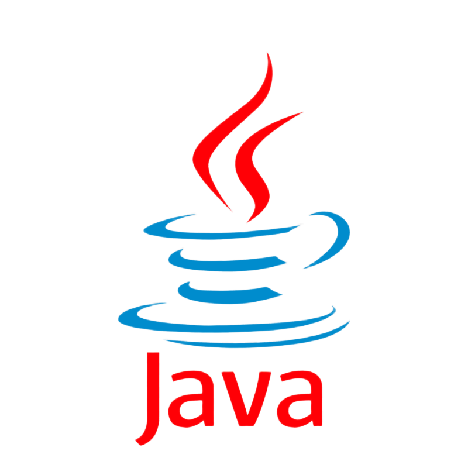

 

  

<h3 align="center">initiation_java</h3>
  

   Initiation au JAVA !
  

# À propos du projet
Ce repo(sitory) est créé dans le but du cours de JAVA au Campus Numérique in The Alps.

Vous trouverez dans le dossier principal `src\fr\raphaelmakaryan` deux dossiers : 
- `exercices`,
- `lombredesdragons`.

Ci-dessous se trouveront les informations importantes des dossiers.

 

# Exercices
Le dossier `exercices` contient, comme son nom l'indique, des exercices pour comprendre et utiliser Java.

 

# L'Ombre des Dragons
Le dossier `lombredesdragons` contient le projet principal du cours de Java, créer un jeu textuel dans le thème "Donjons et Dragons".

J'ai décidé de nommer ce jeu, car c'est le mix entre `La Terre du Milieu : L'Ombre de la guerre ` et `Donjons et Dragons`.
 
J'ai donc pris le titre du jeu vidéo "`L'Ombre de`" et du jeu de rôle "`Dragons`".

## Recommendation
Pour jouer à `L'Ombre des Dragons`, il vous faudra le JDK : [`Java SE 17 (LTS)` (JDK demandé dans le projet)](https://www.oracle.com/java/technologies/downloads/#java17).
 
S'il y a des choses bizarres ou que vous êtes complètement pété (dans le sens que vous êtes puissant), merci de me le signaler.
 
Avec les nombreux tests et debug, j'ai une panoplie de plusieurs variables  pour tester chaque nouvelle fonctionnalité, ce qui fait que je peux laisser en oubliant les variables de debug "allumé".

## Lancer L'Ombre des Dragons
Dans la racine du dossier  `lombredesdragons`, vous trouverez le fichier `Main.java`, vous avez juste à lancer ce fichier et tout se passera dans le terminal !